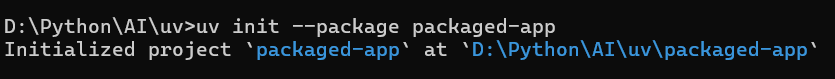
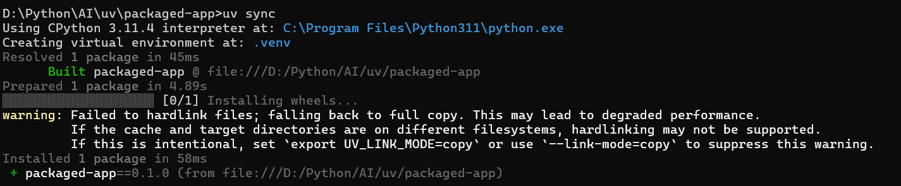
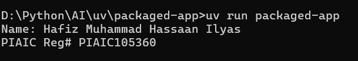

## ⚡ Quick Start

Follow these steps to set up and run the app.

### 1️⃣ Initialize a new package
```bash
uv init --package packaged-app
```


---

### 2️⃣ Sync dependencies
```bash
uv sync
```


---

### 3️⃣ Run the app
```bash
uv run packaged-app
```


---

## 📝 Example Code

`main.py`:
```python
def print_details():
    print_name()
    print_roll_number()

def print_name():
    print("Name: Hafiz Muhammad Hassaan Ilyas")

def print_roll_number():
    print("PIAIC Reg# PIAIC105360")


if __name__ == "__main__":
    print_details()
```

---

## ✅ Expected Output

When you run the app:

```
Name: Hafiz Muhammad Hassaan Ilyas
PIAIC Reg# PIAIC105360
```

---

## 🔧 Requirements

- Python **>=3.8**
- [uv](https://github.com/astral-sh/uv) installed

---
---

## 🏗️ Future Improvements

- Add command-line arguments for dynamic inputs  
- Expand into a multi-module package  
- Write unit tests with `pytest`

---

## 📄 License

This project is licensed under the **MIT License**.  
Feel free to use, modify, and distribute it.