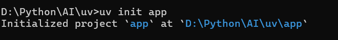
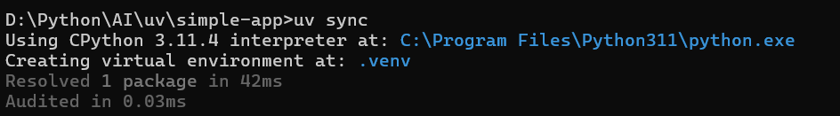
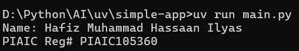

# ▶️ How to Run the App.


## 1️⃣ Initialize the Project
```bash
uv init simple-app
```

📸 Example:  


---

## 2️⃣ Sync Dependencies
```bash
uv sync
```

📸 Example:  


---

## 3️⃣ Run the App
```bash
uv run main.py
```

📸 Example:  


---

✅ That’s it! Your app should now be running successfully.
